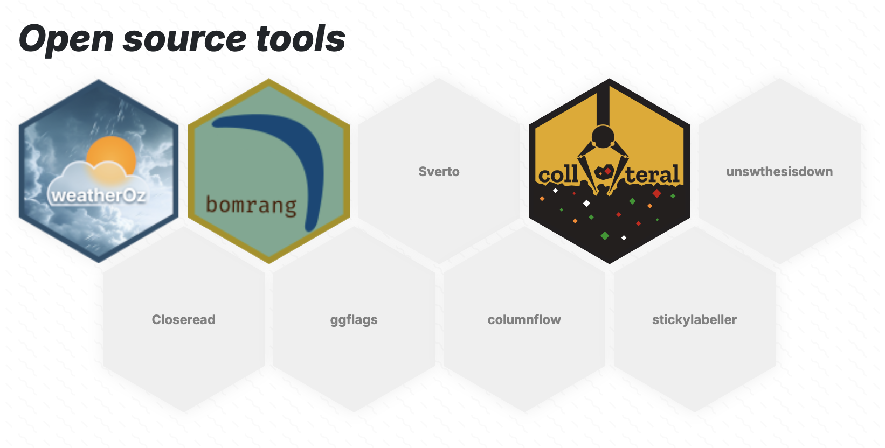

# quarto-hexgrid-listing

Show off your open source contributions on your [Quarto](https://quarto.org) website with this [custom listing](https://quarto.org/docs/websites/website-listings-custom.html).



## Installing


```bash
quarto use template jimjam-slam/quarto-hexgrid-listing
```

This will copy `hexlisting.ejs` into the folder where you intend to have the listing.

> [!IMPORTANT]
> Note that `quarto add` does not presently work with custom listings, and if you use quarto-hexgrid-listing in a subdirectory of your Quarto website, you must run `quarto use template` in that subdirectory.

Once it's installed, provide [`template: hexlisting.ejs`](https://quarto.org/docs/websites/website-listings-custom.html#listing-templates) under the `listing` you want to use.

Having problems with the extension? Got a great idea? [Submit an issue!](/issues/new)

> [!NOTE]
> This extension does not currently support [user tools](https://quarto.org/docs/websites/website-listings.html#user-tools) like sorting, filtering or pagination.
> 
